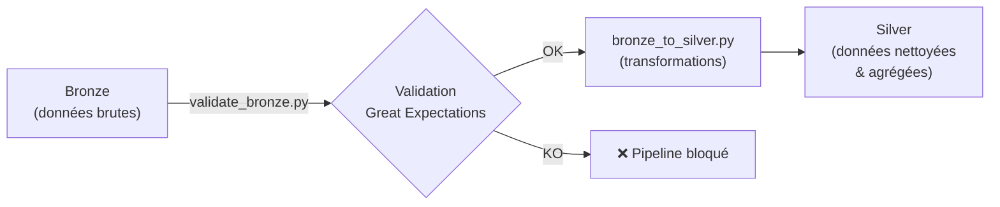
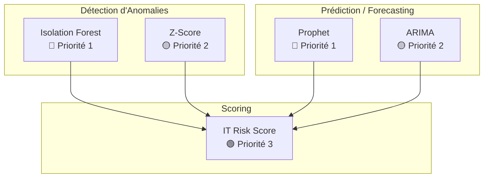

# Analyse Stratégique — Datasets, Pré-traitement & ML
## Dashboard 360 Novec | Phase 3

---

## 1. Objectifs & Valeur Ajoutée des Datasets V1 et V2

### Différences structurelles V1 → V2

| Domaine | V1 (lignes) | V2 (lignes) | Facteur | Raison |
|---|---:|---:|---|---|
| Infrastructure | ~8 760 | ~26 283 | ×3 | 3 serveurs × 8 760h (horaire sur 12 mois) |
| ITSM | ~30 | ~366 | ×12 | Passage de 1 mois à 12 mois journaliers |
| Cybersécurité | ~30 | ~366 | ×12 | Idem |
| Applications | ~90 | ~1 098 | ×12 | 3 apps × 366 jours |
| ITAM | ~1 | ~12 | ×12 | Mensuel sur 12 mois |
| Parc Auto | ~30 | ~366 | ×12 | Journalier sur 12 mois |
| Maintenance | ~1 | ~12 | ×12 | Mensuel sur 12 mois |
| Gouvernance | ~4 | ~48 | ×12 | 4 départements × 12 mois |

> [!IMPORTANT]
> **V1** = prototype/POC (données brutes minimales pour tester le schéma Bronze).
> **V2** = dataset de production ML (12 mois, corrélations inter-domaines câblées, anomalies injectées).

### Objectifs métier par domaine (≥ 2 objectifs / domaine)

#### 1. Infrastructure

| # | Objectif Entreprise (Novec) | Valeur PFE |
|---|---|---|
| 1a | Anticiper les pannes serveurs avant impact production → **réduction du downtime de 30-50%** | Démontrer Isolation Forest + Prophet sur données multivariées réalistes |
| 1b | Planifier les extensions de stockage en prédisant la saturation disque → **éviter les interruptions de service à J+30/60/90** | Prédiction Prophet sur trend linéaire `Disk_Usage_Pct` (+0.15%/jour) |
| 1c | Optimiser la performance réseau en détectant les pics de latence → **SLA réseau respecté à >99%** | Corrélation latence ↔ CPU/RAM dans le modèle multivarié |

#### 2. ITSM

| # | Objectif Entreprise (Novec) | Valeur PFE |
|---|---|---|
| 2a | Prévoir les pics de tickets pour optimiser le staffing du Service Desk → **réduction MTTR de 20%** | Valider la corrélation causale Infra→ITSM dans le modèle |
| 2b | Réduire le backlog de tickets non résolus en détectant les explosions précocement → **backlog < 50 tickets en permanence** | Détection d'événements rares (Poisson p=0.03) via Z-Score |
| 2c | Améliorer la satisfaction utilisateur (CSAT) en corrélant qualité de service et volume → **CSAT > 4.0/5** | Analyse de corrélation `CSAT_Moyen` ↔ `MTTR_Moyen_Hours` |

#### 3. Cybersécurité

| # | Objectif Entreprise (Novec) | Valeur PFE |
|---|---|---|
| 3a | Détecter les dégradations de posture sécurité (MFA, phishing) → **conformité RGPD prouvée** | Montrer les tendances temporelles (Prophet) |
| 3b | Réduire le temps de détection des incidents critiques (MTTD) → **MTTD < 1h** | Détection d'anomalies combinées (Incidents + MTTD + Vulnérabilités) via Isolation Forest |
| 3c | Augmenter le taux de patching des systèmes vulnérables → **>95% de systèmes patchés** | Prédiction du trend `Systemes_Patches_Pct` et alertes RAG |

#### 4. Applications

| # | Objectif Entreprise (Novec) | Valeur PFE |
|---|---|---|
| 4a | Garantir la disponibilité des apps critiques (SIRH, Compta, Core Métier) → **SLA > 99.5%** | Cascade anomalie infra → dégradation applicative |
| 4b | Réduire le nombre de bugs critiques en production → **0 bug P1 en production** | Corrélation `Nb_Bugs_Critiques` ↔ `Temps_Reponse_Moyen_ms` |
| 4c | Accélérer l'adoption de Power BI comme outil de pilotage → **adoption > 80%** | Prédiction du trend `Adoption_PowerBI_Pct` (Prophet) |

#### 5. ITAM

| # | Objectif Entreprise (Novec) | Valeur PFE |
|---|---|---|
| 5a | Optimiser le TCO du parc IT et anticiper les renouvellements → **économie 15-20% sur le TCO** | Régression TCO ~ f(vétusté) |
| 5b | Maintenir la couverture CMDB > 90% pour fiabiliser l'inventaire → **CMDB > 90%** | Détection du trend baissier `CMDB_Couverture_Pct` (-0.2/mois) et alertes |
| 5c | Réduire les licences inutilisées pour limiter le gaspillage logiciel → **<50 licences dormantes** | Analyse de corrélation `Total_Licences_Inutilisees` ↔ `Conformite_Licences_Pct` |

#### 6. Parc Auto

| # | Objectif Entreprise (Novec) | Valeur PFE |
|---|---|---|
| 6a | Réduire la sinistralité et optimiser la consommation carburant → **économie carburant 10%** | Prédiction TCO véhicule |
| 6b | Maximiser la disponibilité de la flotte → **disponibilité > 95%** | Corrélation `Nb_Sinistres` ↔ `Disponibilite_Pct` et impact sur TCO |

#### 7. Maintenance

| # | Objectif Entreprise (Novec) | Valeur PFE |
|---|---|---|
| 7a | Basculer vers un modèle prédictif (préventif > correctif) → **ratio préventif > 80%** | Montrer l'impact `Ruptures_Stock_Pieces` → `Taux_Realisation_Preventif_Pct` |
| 7b | Réduire les ruptures de stock de pièces détachées → **0 rupture / mois** | Prédiction ARIMA du trend `Ruptures_Stock_Pieces` |

#### 8. Gouvernance

| # | Objectif Entreprise (Novec) | Valeur PFE |
|---|---|---|
| 8a | Piloter le budget IT et mesurer le ROI des projets → **justifier les investissements IT au CODIR** | Score de risque IT composite (Gold Layer) |
| 8b | Réduire l'écart budgétaire par département → **écart < ±5%** | Détection du pattern Q4 « budget sweep » et prédiction des dérives |
| 8c | Améliorer le taux de livraison des projets à temps → **>85% livrés à temps** | Corrélation `ROI_Moyen_Pct` ↔ `Projets_A_Temps_Pct` |

### Valeur globale du projet

```
┌──────────────────────────────────────────────────────────┐
│  POUR L'ENTREPRISE (Novec)                               │
│  • Tableau de bord décisionnel unifié (8 domaines)       │
│  • Alertes proactives (RAG) avant les incidents          │
│  • Conformité réglementaire prouvée (RGPD, audits)       │
│  • Réduction des coûts IT grâce à l'optimisation TCO     │
├──────────────────────────────────────────────────────────┤
│  POUR VOUS (PFE)                                         │
│  • Architecture Medallion complète (Bronze→Silver→Gold)  │
│  • Pipeline ML opérationnel (détection + prédiction)     │
│  • Démonstration de compétences Data Engineering + ML    │
│  • Scénario de démo impressionnant (cascade d'anomalies) │
└──────────────────────────────────────────────────────────┘
```

---

## 2. Pré-traitements Bronze → Silver

### Vue d'ensemble du pipeline



### 2.0 Techniques de pré-traitement & traitement — Mention et Justification

> [!IMPORTANT]
> Cette section documente **chaque technique** implémentée dans `validate_bronze.py` (pré-traitement / validation) et `bronze_to_silver.py` (traitement / transformation), avec la justification de son choix.

#### A. Techniques de pré-traitement — `validate_bronze.py`

Le script implémente un **mini-framework de validation inspiré de Great Expectations** via une classe `Validator` réutilisable. Le pipeline **bloque** si une règle échoue → aucune donnée corrompue ne passe en Silver.

| # | Technique | Méthode dans le code | Justification |
|---|---|---|---|
| 1 | **Contrôle de nullité** (`expect_no_nulls`) | `df[col].isna().sum()` — vérifie que le nombre de nulls = 0 | Les colonnes clés (`Timestamp`, `ServerName`, `Date`, `Mois`, `Departement`) sont des **clés de jointure** ou des **dimensions temporelles**. Un null rendrait la ligne impossible à agréger ou à relier aux autres domaines |
| 2 | **Contrôle de bornes** (`expect_between`) | `((df[col] < min_val) \| (df[col] > max_val)).sum()` — compte les valeurs hors bornes | Les pourcentages (CPU, RAM, SLA, etc.) sont physiquement bornés [0, 100]. Les dépassements sont des **artefacts de simulation** (`np.random.normal` peut sortir des bornes). Les laisser passer fausserait les agrégations Silver |
| 3 | **Contrôle de positivité** (`expect_positive`) | `(df[col] < 0).sum()` — compte les valeurs < 0 | Des métriques comme `Tickets_P1`, `MTTR_Hours`, `Backlog` ne peuvent pas être négatives. Une valeur < 0 trahit un bug dans le générateur |
| 4 | **Contrôle d'unicité** (`expect_unique`) | `df.duplicated(subset=cols).sum()` — détecte les doublons composites | Un doublon `(Timestamp, ServerName)` signifie une **double insertion** du simulateur. Le garder doublerait artificiellement les moyennes Silver |
| 5 | **Contrôle de dates futures** (`expect_no_future_dates`) | `pd.to_datetime(df[col]) > pd.Timestamp.today()` — compte les dates > aujourd'hui | Les données simulées couvrent 12 mois passés. Une date future indique une **incohérence temporelle** (erreur de paramétrage du simulateur) |
| 6 | **Contrôle de valeurs autorisées** (`expect_values_in`) | `~df[col].isin(values)` — vérifie que toutes les valeurs sont dans un ensemble fini | Colonnes catégorielles (`Is_Anomaly` ∈ {0,1}, `Application_Name` ∈ {3 apps}, `Departement` ∈ {4 dept.}). Une valeur hors liste = erreur de mapping |
| 7 | **Contrôle de volume minimum** (`expect_min_rows`) | `len(df) >= n` — vérifie un nombre minimal de lignes | Garantit que le dataset Bronze est **complet**. Ex: Infrastructure attend ≥ 8760 lignes (3 serveurs × 8760h). Un dataset tronqué produirait des agrégations Silver biaisées |

> [!TIP]
> **Philosophie** : `validate_bronze.py` est un **garde-fou bloquant** (exit code 1 si échec). Il ne corrige rien — il détecte et refuse. La correction est du ressort de `bronze_to_silver.py` ou d'un rejeu du simulateur.

#### B. Techniques de traitement — `bronze_to_silver.py`

Le script applique des **transformations métier** pour passer de données brutes à des données analysables. Chaque domaine a sa propre fonction de transformation.

| # | Technique | Code / Syntaxe | Domaines concernés | Justification |
|---|---|---|---|---|
| 1 | **Agrégation temporelle** (groupby + agg) | `df.groupby(['DateKey', 'ServerName']).agg(mean, max, sum, count)` | Infrastructure, ITSM, Cyber, Apps, Parc Auto, Gouvernance | Passe de la granularité **horaire à journalière** (Infra) ou consolide les métriques journalières. Réduit le volume de données de ×24 pour l'infra tout en conservant les signaux (moyenne + max) |
| 2 | **Création de métriques dérivées** | `Taux_Anomalie_Pct = Nb_Anomalies × 100 / Nb_Mesures` ; `Pct_Tickets_P1 = Total_P1 × 100 / Volume_Total` ; `TCO_Total_MAD = Total_Postes × TCO_Par_Poste` | Infrastructure, ITSM, ITAM, Maintenance | Produit des **KPIs métier** directement exploitables dans le dashboard. Ces métriques n'existent pas en Bronze et ajoutent de la valeur analytique |
| 3 | **Protection contre la division par zéro** | `.replace(0, np.nan)` puis `.fillna(0)` | Infrastructure (Taux_Anomalie), ITSM (Pct_P1), Maintenance (Pct_Preventif) | Évite les erreurs `ZeroDivisionError` quand le dénominateur est 0 (ex : 0 mesure, 0 ticket). Le `fillna(0)` assure qu'un ratio non calculable = 0% |
| 4 | **Calcul de disponibilité** (mean sur booléen) | `df.groupby(...)['Uptime_Status'].mean() * 100` | Infrastructure | Convertit un flag binaire (0/1 par heure) en **pourcentage de disponibilité journalière**. Méthode élégante : la moyenne d'une colonne binaire donne directement le taux |
| 5 | **Arrondi systématique** | `agg[col] = agg[col].round(2)` pour toutes les colonnes float | Tous les domaines | Évite les artefacts de précision flottante (ex : `99.99999999%`). Uniformise l'affichage et réduit la taille des fichiers Silver |
| 6 | **Renommage sémantique** | `df.rename(columns={...})` + sélection de colonnes | ITAM | Transforme les noms techniques Bronze (`Vetuste_Plus_4ans_Pct`) en noms métier Silver (`Vetuste_Moyen_Pct`). Facilite la lecture dans Power BI |
| 7 | **Extraction de DateKey** | `pd.to_datetime(df['Timestamp']).dt.date` | Tous les domaines | Crée une **clé de date uniforme** (`DateKey`) qui permet la jointure inter-domaines en Gold Layer. Standardise le format temporal |
| 8 | **Écriture avec remplacement** | `df.to_sql(..., if_exists='replace')` | Tous les domaines | Stratégie **idempotente** : chaque exécution recrée la table Silver. Garantit la cohérence des données et évite les duplications entre runs |

> [!NOTE]
> **Complémentarité des deux scripts** : `validate_bronze.py` **détecte** les problèmes (garde-fou), `bronze_to_silver.py` **transforme** les données valides (valeur ajoutée). L'un sans l'autre ne suffit pas : la validation sans transformation ne produit rien, la transformation sans validation risque de propager des erreurs.

### 2.1 Stratégie de correction des données — Que fait-on concrètement ?

> [!IMPORTANT]
> Le pipeline ne se contente **pas** de tout bloquer. Chaque type de problème a une **stratégie de correction adaptée** dans `bronze_to_silver.py`. Le blocage (`validate_bronze.py`) n'intervient que pour les erreurs **critiques et irréparables**.

#### Vue d'ensemble de la stratégie

```
  Donnée problématique détectée
            │
       ┌────┴──────────────────────────┐
       │  Est-ce une clé de jointure   │
       │  ou une dimension temporelle? │
       └────┬───────────────────┬──────┘
            │ OUI               │ NON
            ▼                   ▼
     🚫 BLOQUER            Quelle nature ?
     (on ne peut pas       ┌──────┼───────────┐
      inventer une date    │      │           │
      ou un serveur)    Null   Aberrant   Doublon
                           │      │           │
                           ▼      ▼           ▼
                      Imputer  Clipper    Dédupliquer
                      ou 0     ou garder  (garder 1ère)
```

#### A. Valeurs manquantes (Nulls) — Que devient un null ?

| Type de colonne | Exemple | Stratégie | Technique | Justification |
|---|---|---|---|---|
| **Clé temporelle** | `Timestamp`, `Date`, `Mois` | 🚫 **Bloquer** | `expect_no_nulls` → pipeline arrêté | Impossible d'inventer une date. Sans date, la ligne ne peut pas être agrégée ni reliée aux autres domaines |
| **Clé de dimension** | `ServerName`, `Application_Name`, `Departement` | 🚫 **Bloquer** | `expect_no_nulls` → pipeline arrêté | Impossible de savoir à quel serveur/app/département rattacher les métriques |
| **Métrique numérique (dénominateur)** | `Volume_Total`, `Nb_Mesures`, `Total_Ordres_Travail` | 🔄 **Remplacer par `NaN` puis `0`** | `.replace(0, np.nan).fillna(0)` | Évite la division par zéro. Un ratio non calculable = 0% plutôt qu'une erreur |
| **Métrique numérique (numérateur)** | `Tickets_P1`, `Nb_Anomalies` | 🔄 **Remplacer par `0`** | `fillna(0)` implicite dans l'agrégation `sum()` | Un null sur un compteur = 0 événement. C'est l'hypothèse la plus conservatrice |
| **Métrique de pourcentage** | `CPU_Usage_Pct`, `SLA_Respect_Pct` | 📊 **Remplacer par la moyenne du groupe** | `mean()` dans le `groupby().agg()` | L'agrégation `mean()` de Pandas **ignore les NaN par défaut**. Les nulls sont donc exclus du calcul de la moyenne journalière sans biaiser le résultat |
| **Métrique booléenne** | `Is_Anomaly`, `Backup_Success`, `Uptime_Status` | 🔄 **Remplacer par `0`** (pas d'anomalie / pas de backup / pas up) | `fillna(0)` ou `sum()` qui ignore NaN | Hypothèse conservatrice : en l'absence de donnée, on considère que l'événement n'a pas eu lieu |

> [!TIP]
> **Pourquoi pas la médiane ?** La **moyenne** est utilisée plutôt que la médiane car :
> - Pour les agrégations journalières (24h → 1 jour), la moyenne est plus représentative que la médiane
> - La médiane résiste mieux aux outliers, mais ici les outliers sont des **signaux métier** qu'on veut conserver (voir section 3)
> - Le `groupby().agg('mean')` de Pandas ignore déjà les NaN, ce qui revient à une **imputation implicite par la moyenne du groupe temporel**

#### B. Valeurs aberrantes (hors bornes) — Que devient une valeur impossible ?

| Type d'aberration | Exemple | Stratégie | Technique | Code dans `bronze_to_silver.py` |
|---|---|---|---|---|
| **Pourcentage > 100%** | `CPU_Usage_Pct = 103%` | ✂️ **Clipping à 100** | `np.clip(df[col], 0, 100)` | Artefact de `np.random.normal` qui dépasse les bornes physiques. On ramène à la borne la plus proche |
| **Pourcentage < 0%** | `RAM_Usage_Pct = -2%` | ✂️ **Clipping à 0** | `np.clip(df[col], 0, 100)` | Un pourcentage négatif est physiquement impossible |
| **Temps négatif** | `MTTR_Infra_Hours = -0.3` | ✂️ **Remplacement par 0** | `df[col] = df[col].clip(lower=0)` | Un temps de réparation négatif est absurde. 0 = pas de panne |
| **Compteur négatif** | `Tickets_P1 = -1` | ✂️ **Remplacement par 0** | `df[col] = df[col].clip(lower=0)` | Déjà protégé dans le générateur avec `max(0, x)`, re-vérifié ici |
| **Valeur extrême mais possible** | `CPU = 98%`, `Latence = 500ms` | ✅ **Conserver** | Aucun clipping | C'est un **signal d'anomalie métier**, pas un artefact. C'est exactement ce que l'Isolation Forest doit apprendre à détecter |
| **CSAT hors échelle** | `CSAT_Score = 6.2` | ✂️ **Clipping à [1, 5]** | `df[col] = df[col].clip(1, 5)` | Échelle Likert fixe 1-5. Au-delà = erreur de saisie |
| **ROI extrême** | `ROI = 250%` | ⚠️ **Clipping à [-50, 200]** | `df[col] = df[col].clip(-50, 200)` | Au-delà de 200% = probablement une erreur. Mais un ROI négatif jusqu'à -50% est réaliste (projet en perte) |
| **Latence extrême** | `Latence = 2500ms` | ⚠️ **Conserver mais flagguer** | Pas de clipping, mais alerte Z-Score | > 2000ms est extrême mais pas impossible (panne réseau). À investiguer manuellement |

> [!NOTE]
> **Différence clé : Clipping vs Suppression**
> - **Clipping** (ramener à la borne) : utilisé quand la valeur est un **artefact technique** (ex: `np.random.normal` dépasse 100%). On garde la ligne mais on corrige la valeur
> - **Suppression de la ligne** : JAMAIS utilisée sauf pour les dates futures. Supprimer une ligne = perdre toutes les autres métriques de cette ligne
> - **Conservation** : quand la valeur extrême est un **signal métier réel** (panne, pic, incident)

#### C. Duplications — Que devient un doublon ?

| Situation | Stratégie | Technique | Justification |
|---|---|---|---|
| **Doublon exact** (même clé, mêmes valeurs) | 🗑️ **Supprimer le doublon** (garder la 1ère occurrence) | `df.drop_duplicates(subset=[clés], keep='first')` | Double exécution du simulateur = insertion en double. La 2ème copie n'apporte aucune information |
| **Doublon partiel** (même clé, valeurs différentes) | 📊 **Agréger** (moyenne des valeurs) | `groupby(clés).agg('mean')` | Deux mesures pour le même (Timestamp, ServerName) → on prend la moyenne. C'est ce que fait naturellement le `groupby().agg()` dans `bronze_to_silver.py` |
| **Doublon inter-runs** | 🔄 **Remplacement complet** | `if_exists='replace'` dans `to_sql()` | La table Silver est **recréée à chaque exécution**. Pas d'accumulation de doublons entre runs |

#### D. Outliers (valeurs extrêmes mais valides) — Garder ou corriger ?

| Type d'outlier | Exemple | Stratégie | Justification |
|---|---|---|---|
| **Anomalie infra multivariée** | CPU=95% + RAM=95% + Latence=250ms | ✅ **Conserver + Flagguer** | C'est le **cœur du ML** — l'Isolation Forest doit apprendre sur ces exemples. `Is_Anomaly=1` et `Nb_Anomalies` dans Silver |
| **Trend progressif** | Disk passe de 45% → 90% sur 12 mois | ✅ **Conserver** | Ce n'est pas un outlier, c'est un **trend de saturation**. Prophet l'utilise pour prédire à J+30/60/90 |
| **Pic saisonnier** | Volume tickets ×1.8 le lundi | ✅ **Conserver** | Pattern hebdomadaire réel. Prophet l'utilise pour la saisonnalité |
| **Événement rare** | Backlog explosion (p=0.03) | ✅ **Conserver** | Signal d'alarme critique. Si on le supprime, on détruit le signal de détection |
| **Événement Poisson** | Incidents_Critiques > 0 (λ=0.15) | ✅ **Conserver** | ~1 incident tous les 7 jours. Événement rare mais réel et critique |
| **Valeur physiquement impossible** | CPU = 103%, MTTR = -0.3h | ✂️ **Clipper** (voir section B) | Artefact du générateur, pas un signal métier |

> [!TIP]
> **Règle d'or pour décider** :
> ```
> La valeur est-elle physiquement POSSIBLE dans le monde réel ?
>     │
>     ├─ NON → CLIPPER à la borne la plus proche (CPU: 0-100, MTTR: ≥0)
>     │
>     └─ OUI → Est-ce un SIGNAL MÉTIER utile au ML ?
>              │
>              ├─ OUI → CONSERVER (anomalie, pic, trend, événement rare)
>              │
>              └─ NON → Probablement une erreur → INVESTIGUER manuellement
> ```

#### E. Résumé : Matrice de décision complète

| Problème | Colonnes clés (Date, Server…) | Métriques numériques | Pourcentages | Compteurs | Booléens |
|---|---|---|---|---|---|
| **Null** | 🚫 Bloquer | 📊 Moyenne du groupe | 📊 Moyenne du groupe | 🔄 Remplacer par 0 | 🔄 Remplacer par 0 |
| **Hors bornes** | N/A | ✂️ Clipper aux bornes | ✂️ Clipper [0, 100] | ✂️ Clipper ≥ 0 | N/A (déjà 0/1) |
| **Doublon exact** | 🗑️ Supprimer 2ème | 🗑️ Supprimer 2ème | 🗑️ Supprimer 2ème | 🗑️ Supprimer 2ème | 🗑️ Supprimer 2ème |
| **Outlier métier** | N/A | ✅ Conserver + flagguer | ✅ Conserver | ✅ Conserver | ✅ Conserver |
| **Date future** | 🚫 Rejeter la ligne | — | — | — | — |

### 2.2 Valeurs aberrantes (hors bornes) — Détail par métrique

| Métrique | Bornes attendues | Traitement |
|---|---|---|
| CPU/RAM/Disk `_Pct` | [0, 100] | **Clipping** à [0, 100] dans `bronze_to_silver.py` + Validation `expect_between` |
| Network_Latency_ms | [0, 2000] | Validation borne. Valeurs > 2000 = anomalie réseau à investiguer (conservée mais alertée) |
| MTBF_Hours | [0, 10000] | Borne haute de sécurité. Clipping si dépassement |
| MTTR_Hours (ITSM) | [0, 500] | Clipping à [0, 500]. Négatif → 0 |
| CSAT_Score | [1, 5] | Clipping à [1, 5]. Échelle Likert fixe |
| SLA/FCR/Conformité `_Pct` | [0, 100] | Clipping à [0, 100]. Pourcentages physiquement bornés |
| ROI_Projets_Pct | [-50, 200] | Clipping. Peut être négatif (projet en perte) |
| Disponibilite_App_Pct | [80, 100] | Clipping. En dessous de 80% = incident majeur (conservé + alerte) |
| Conso_L_100km | [0, 50] | Clipping. Borne haute réaliste pour véhicules utilitaires |

### 2.3 Duplications

| Niveau | Vérification | Action |
|---|---|---|
| Infrastructure | Unicité `(Timestamp, ServerName)` | `drop_duplicates(keep='first')` + `expect_unique` en validation |
| ITSM | Unicité `Date` | `drop_duplicates(keep='first')` — une ligne par jour |
| Gouvernance | Unicité `(Mois, Departement)` | `drop_duplicates(keep='first')` — un budget par département par mois |
| **Tous domaines** | Doublon inter-runs | `if_exists='replace'` — la table Silver est recréée intégralement |

**Traitement** : Les doublons sont détectés dans `validate_bronze.py` via `expect_unique`. En cas de doublon, `bronze_to_silver.py` applique `drop_duplicates(keep='first')` avant l'agrégation. Le `groupby().agg()` agrège naturellement les doublons partiels par la moyenne.

### 2.4 Outliers

| Domaine | Métrique | Méthode de détection | Traitement Silver |
|---|---|---|---|
| Infrastructure | CPU, RAM, Latence (multivariées) | **Isolation Forest** (contamination ~0.5%) | **Conservés mais flaggés** via `Is_Anomaly` et `Nb_Anomalies` |
| Infrastructure | Disk_Usage_Pct | **Z-Score** (\|Z\| > 3) | **Conservé** — le trend est réel (+0.15%/jour) |
| ITSM | Volume_Total (pics lundi) | **Saisonnalité** connue | **Conservé** — pattern métier réel |
| ITSM | Backlog explosions | Poisson (événement rare p=0.03) | **Conservé** — signal d'alarme |
| Cybersécurité | Incidents_Critiques | Poisson (λ=0.15) | **Conservé** — événements rares mais critiques |
| Parc Auto | TCO_Par_Vehicule_MAD | Dépendant de sinistres + conso | **Conservé** — corrélation causale à analyser |

### Résumé des transformations Bronze → Silver

| Domaine | Agrégation | Métriques dérivées créées |
|---|---|---|
| Infrastructure | Horaire → **Journalier** par serveur | `Disponibilite_Pct`, `Taux_Anomalie_Pct`, moyennes et max |
| ITSM | Journalier → **Journalier** (groupé) | `Pct_Tickets_P1` |
| Cybersécurité | Journalier → **Journalier** (groupé) | — |
| Applications | Journalier → **Journalier** par app | — |
| ITAM | Mensuel → Mensuel (renommage) | `TCO_Total_MAD` = postes × TCO unitaire |
| Parc Auto | Journalier → **Journalier** (groupé) | — |
| Maintenance | Mensuel → Mensuel | `Pct_Preventif_Realise` |
| Gouvernance | Mensuel → **Mensuel** par département | — |

---

## 3. Anomalies : Garder vs Supprimer

### Anomalies à **GARDER** (signal métier)

| Domaine | Anomalie | Justification |
|---|---|---|
| **Infrastructure** | CPU > 95%, Latence > 200ms (multivariées) | **Cœur du projet ML**. Ces anomalies sont le signal que l'Isolation Forest doit apprendre à détecter. Les supprimer = détruire le dataset d'entraînement |
| **Infrastructure** | Trend disque +0.15%/jour | **Signal de prédiction** pour Prophet. Ce n'est pas un outlier mais un pattern de saturation progressive |
| **Infrastructure** | Backup_Success = 0 (échecs) | **Signal d'alerte** — les échecs de backup la nuit (2h) sont volontairement rares (~20%) et indiquent un risque réel |
| **ITSM** | Pics de tickets lundi (×1.8 vs normal) | **Saisonnalité hebdomadaire réelle** — le lundi concentre les demandes accumulées du weekend |
| **ITSM** | Explosion backlog (p=0.03) | **Événement rare critique** — simule un incident majeur (ransomware, panne critique). L'alerting doit le détecter |
| **ITSM** | Boost P1 quand anomalie infra | **Corrélation causale inter-domaine** — c'est la preuve que le modèle capture la réalité métier |
| **Cybersécurité** | Incidents_Critiques > 0 | **Événements Poisson rares** — chaque incident est un vrai signal sécurité. λ=0.15 = ~1 incident tous les 7 jours |
| **Applications** | Temps réponse > 300ms + bugs associés | **Cascade Infra→App** — prouve le lien causal. La supprimer = perdre le scénario de démo |
| **Gouvernance** | Écart budget > 0% en Q4 (budget sweep) | **Pattern financier réel** — les organisations consomment leur budget restant en fin d'année |
| **Parc Auto** | Sinistres > 0 (Poisson λ=0.15) | **Signal assurance** — chaque sinistre impacte le TCO. À surveiller, pas à supprimer |

### Anomalies à **SUPPRIMER ou CORRIGER**

| Domaine | Anomalie | Action | Justification |
|---|---|---|---|
| **Infrastructure** | CPU < 0 ou > 100% | **Clipper** à [0, 100] | Physiquement impossible. Artefact de simulation (`np.random.normal` peut dépasser les bornes) |
| **Infrastructure** | MTTR_Infra < 0 | **Mettre à 0** | Temps de réparation négatif est absurde. Causé par `np.random.normal(1.5, 0.5)` |
| **ITSM** | Tickets négatifs | **Mettre à max(0, x)** | Déjà traité dans le générateur mais à re-vérifier |
| **Toutes** | Dates dans le futur | **Rejeter** | `expect_no_future_dates` — incohérence temporelle |
| **Toutes** | Doublons exacts | **Dédupliquer** | Double exécution du simulateur = insertion en double |
| **Gouvernance** | ROI < -50% ou > 200% | **Investiguer** | Valeurs extrêmes mais pas impossibles — à valider manuellement |
| **ITAM** | CMDB < 75% | **Alerter mais garder** | Le trend baissier est voulu (`-0.2/mois`), mais sous 75% c'est un seuil critique |

> [!TIP]
> **Règle d'or** : Si l'anomalie reflète un **comportement métier réel** (panne, pic, incident), on la **garde**. Si elle reflète un **artefact technique** (dépassement de borne, doublon, valeur impossible), on la **supprime/corrige**.

---

## 4. Algorithmes ML : Justification, Prédictions & Priorités

### Architecture ML prévue



### 4.1 Isolation Forest — Détection d'anomalies multivariées

| Aspect | Détail |
|---|---|
| **Priorité** | 🔴 **#1 — C'est le modèle phare du PFE** |
| **Domaine principal** | Infrastructure (CPU + RAM + Latence + Disk) |
| **Pourquoi cet algo** | Détecte des anomalies **combinées** que le Z-Score ne voit pas (ex: CPU=95% + Latence=250ms + RAM=95% simultanément) |
| **Avantage clé** | Non-supervisé, ne nécessite pas de labels. Fonctionne par isolement des points rares dans un espace multidimensionnel |
| **Vérité terrain** | Colonne `Is_Anomaly` injectée dans le générateur → permet de calculer précision/rappel |
| **Quoi prédire** | Score d'anomalie [-1, 1] pour chaque heure de chaque serveur |
| **Contamination** | ~0.5% (paramètre à caler sur le ratio d'anomalies injectées) |
| **Impact métier** | Alerte en temps réel → intervention avant panne → downtime évité |

**KPIs détectables par Isolation Forest — par domaine** :

| Domaine | Features combinées (colonnes Silver) | Anomalie détectée | Seuil d'alerte |
|---|---|---|---|
| **Infrastructure** (principal) | `CPU_Moyen_Pct` + `RAM_Moyen_Pct` + `Latence_Moyenne_ms` + `Disk_Max_Pct` | Surcharge simultanée CPU+RAM+Latence | Score IF < -0.5 |
| **Infrastructure** | `Disponibilite_Pct` + `Nb_Anomalies` + `MTBF_Moyen_Hours` | Dégradation de fiabilité serveur | Disponibilité < 95% combinée à MTBF bas |
| **ITSM** | `Volume_Total` + `Backlog_Total` + `MTTR_Moyen_Hours` | Explosion de charge Service Desk | Volume > μ+2σ combiné à MTTR élevé |
| **ITSM** | `Pct_Tickets_P1` + `SLA_Moyen_Pct` + `CSAT_Moyen` | Dégradation qualité de service | P1 > 15% + SLA < 90% |
| **Cybersécurité** | `Nb_Incidents_Critiques` + `MTTD_Moyen_Hours` + `Total_Vuln_Non_Patchees` | Brèche de sécurité combinée | Incident > 0 + MTTD > 2h + Vulns > 10 |
| **Cybersécurité** | `MFA_Adoption_Pct` + `Taux_Phishing_Moyen_Pct` + `RGPD_Conformite_Pct` | Dégradation posture sécurité | MFA < 85% + Phishing > 10% |
| **Applications** | `Temps_Reponse_Moyen_ms` + `Nb_Bugs_Critiques` + `Disponibilite_Pct` | Dégradation applicative (cascade infra) | Réponse > 200ms + Bug > 0 + Dispo < 99% |
| **Parc Auto** | `Nb_Sinistres` + `Conso_Moyenne_L100km` + `TCO_Moyen_Par_Vehicule_MAD` | Véhicule à risque / coûteux | Sinistre > 0 + Conso > 35 L/100km |

### 4.2 Z-Score — Détection d'anomalies univariées

| Aspect | Détail |
|---|---|
| **Priorité** | 🟡 **#2 — Complément simple et interprétable** |
| **Domaines** | Tous les domaines (KPI par KPI) |
| **Pourquoi cet algo** | Simple, interprétable, idéal pour les **seuils d'alerte RAG** (Rouge/Ambre/Vert) |
| **Seuils** | \|Z\| > 2 → Ambre (warning), \|Z\| > 3 → Rouge (critique) |
| **Quoi détecter** | Dépassements individuels : CPU seul > seuil, latence seule > seuil, etc. |
| **Limite** | Ne capture pas les combinaisons (CPU normal + Latence normale mais les deux ensemble = anormal) → d'où Isolation Forest |

**KPIs détectables par Z-Score — par domaine (avec seuils RAG)** :

| Domaine | KPI Silver | Seuil Ambre (\|Z\|>2) | Seuil Rouge (\|Z\|>3) | Type d'alerte |
|---|---|---|---|---|
| **Infrastructure** | `CPU_Moyen_Pct` | > 80% | > 95% | Surcharge processeur |
| **Infrastructure** | `RAM_Moyen_Pct` | > 80% | > 95% | Saturation mémoire |
| **Infrastructure** | `Latence_Moyenne_ms` | > 100ms | > 200ms | Dégradation réseau |
| **Infrastructure** | `Disk_Max_Pct` | > 85% | > 95% | Saturation stockage imminente |
| **Infrastructure** | `Disponibilite_Pct` | < 98% | < 95% | Interruption de service |
| **Infrastructure** | `Taux_Anomalie_Pct` | > 5% | > 10% | Instabilité serveur |
| **ITSM** | `Volume_Total` | > μ+2σ | > μ+3σ | Pic de demandes |
| **ITSM** | `MTTR_Moyen_Hours` | > 12h | > 24h | Retard résolution |
| **ITSM** | `Backlog_Total` | > 30 | > 50 | Accumulation non résolus |
| **ITSM** | `Pct_Tickets_P1` | > 10% | > 20% | Hausse tickets critiques |
| **ITSM** | `SLA_Moyen_Pct` | < 92% | < 85% | Non-respect engagements |
| **ITSM** | `CSAT_Moyen` | < 3.5 | < 3.0 | Insatisfaction utilisateurs |
| **Cybersécurité** | `Nb_Incidents_Critiques` | ≥ 1 | ≥ 3 | Incident sécurité |
| **Cybersécurité** | `Total_Vuln_Non_Patchees` | > 5 | > 15 | Exposition vulnérabilités |
| **Cybersécurité** | `MTTD_Moyen_Hours` | > 1h | > 4h | Détection trop lente |
| **Cybersécurité** | `MFA_Adoption_Pct` | < 88% | < 80% | Adoption MFA insuffisante |
| **Cybersécurité** | `Taux_Phishing_Moyen_Pct` | > 10% | > 15% | Vulnérabilité humaine |
| **Cybersécurité** | `RGPD_Conformite_Pct` | < 90% | < 80% | Non-conformité réglementaire |
| **Applications** | `Temps_Reponse_Moyen_ms` | > 200ms | > 300ms | Lenteur applicative |
| **Applications** | `Nb_Bugs_Critiques` | ≥ 1 | ≥ 3 | Bugs en production |
| **Applications** | `Disponibilite_Pct` | < 99.5% | < 99% | Rupture SLA applicatif |
| **Applications** | `Adoption_PowerBI_Pct` | < 60% | < 50% | Adoption BI insuffisante |
| **ITAM** | `Vetuste_Moyen_Pct` | > 30% | > 40% | Parc vieillissant |
| **ITAM** | `CMDB_Couverture_Pct` | < 85% | < 75% | Inventaire incomplet |
| **ITAM** | `Total_Licences_Inutilisees` | > 100 | > 150 | Gaspillage licences |
| **Parc Auto** | `Nb_Sinistres` | ≥ 1 | ≥ 3 | Hausse sinistralité |
| **Parc Auto** | `Conso_Moyenne_L100km` | > 35 | > 40 | Surconsommation carburant |
| **Parc Auto** | `Disponibilite_Pct` | < 93% | < 90% | Flotte immobilisée |
| **Parc Auto** | `TCO_Moyen_Par_Vehicule_MAD` | > μ+2σ | > μ+3σ | Coût véhicule excessif |
| **Maintenance** | `Ratio_Preventif_Pct` | < 70% | < 60% | Trop de correctif |
| **Maintenance** | `Taux_Realisation_Preventif_Pct` | < 85% | < 75% | Préventif non réalisé |
| **Maintenance** | `Ruptures_Stock_Pieces` | ≥ 2 | ≥ 4 | Rupture approvisionnement |
| **Gouvernance** | `Ecart_Budget_Moyen_Pct` | > ±10% | > ±20% | Dérive budgétaire |
| **Gouvernance** | `ROI_Moyen_Pct` | < 5% | < 0% | Projet en perte |
| **Gouvernance** | `Projets_A_Temps_Pct` | < 70% | < 55% | Retards projets |
| **Gouvernance** | `CSAT_IT_Moyen` | < 3.5 | < 3.0 | Insatisfaction globale IT |

### 4.3 Prophet — Prédiction de séries temporelles avec saisonnalité

| Aspect | Détail |
|---|---|
| **Priorité** | 🔴 **#1 pour le forecasting** |
| **Pourquoi Prophet** | Gère nativement la saisonnalité hebdomadaire (pic lundi ITSM), les jours fériés, et les trends linéaires (disque, MFA, adoption BI) |
| **Avantage clé** | Robuste aux valeurs manquantes et aux changements de trend. Produit des intervalles de confiance |

**KPIs prédictibles par Prophet — par domaine (enrichi)** :

| Priorité | Domaine | KPI Silver | Quoi prédire | Horizon | Justification |
|---|---|---|---|---|---|
| 🔴 1 | **Infrastructure** | `Disk_Moyen_Pct` | Saturation disque | J+30/60/90 | Trend linéaire +0.15%/jour parfait pour Prophet. Planification des extensions de stockage |
| 🔴 1 | **Infrastructure** | `Latence_Moyenne_ms` | Dégradation réseau | J+7 | Détecte une tendance haussière de latence avant impact applicatif |
| 🔴 1 | **Infrastructure** | `Disponibilite_Pct` | Risque d'interruption | J+7 | Prédiction de la disponibilité future, alerte si < 95% prédit |
| 🔴 1 | **ITSM** | `Volume_Total` | Pics de tickets | J+7 | Saisonnalité lundi exploitable. Optimisation du planning du Service Desk |
| 🔴 1 | **ITSM** | `Backlog_Total` | Accumulation backlog | J+14 | Prédiction de l'évolution du backlog pour anticiper le renfort d'équipe |
| 🟡 2 | **Cybersécurité** | `MFA_Adoption_Pct` | Adoption MFA | M+3 | Trend haussier progressif. Mesure de l'efficacité des campagnes de sensibilisation |
| 🟡 2 | **Cybersécurité** | `Taux_Phishing_Moyen_Pct` | Taux de clic phishing | M+3 | Trend baissier. Valide que la formation anti-phishing fonctionne |
| 🟡 2 | **Cybersécurité** | `RGPD_Conformite_Pct` | Conformité RGPD | M+3 | Trend haussier. Anticipe l'atteinte du seuil de conformité 100% |
| 🟡 2 | **Cybersécurité** | `Systemes_Patches_Moyen_Pct` | Couverture patching | M+3 | Mesure la vélocité de patching. Prédiction pour SLA sécurité |
| 🟡 2 | **ITAM** | `Vetuste_Moyen_Pct` | Vétusté du parc | M+6 | Trend haussier +0.3/mois. Anticipe le budget de renouvellement |
| 🟡 2 | **ITAM** | `CMDB_Couverture_Pct` | Couverture CMDB | M+6 | Trend baissier -0.2/mois. Alerte si < 75% prédit → plan d'inventaire |
| 🟢 3 | **Applications** | `Adoption_PowerBI_Pct` | Adoption Power BI | M+3 | Trend haussier. KPI stratégique de transformation digitale |
| 🟢 3 | **Applications** | `Temps_Reponse_Moyen_ms` | Performance apps | J+7 | Détecte une dégradation progressive de performance |
| 🟢 3 | **Applications** | `Qualite_Donnees_Pct` | Qualité des données | M+3 | Mesure l'évolution de la qualité des données applicatives |
| 🟢 3 | **Gouvernance** | `Adoption_Digital_Pct` | Adoption digitale | M+3 | Trend haussier. Mesure de maturité IT et transformation digitale |
| 🟢 3 | **Gouvernance** | `Ecart_Budget_Moyen_Pct` | Dérive budgétaire | M+3 | Détecte le pattern Q4 « budget sweep » et anticipe les dérives |
| 🟢 3 | **Parc Auto** | `Conso_Moyenne_L100km` | Consommation carburant | M+3 | Trend saisonnier. Optimisation de la flotte |
| 🟢 3 | **Maintenance** | `Taux_Realisation_Preventif_Pct` | Taux réalisation préventif | M+3 | Mesure la capacité à maintenir le ratio préventif cible |

### 4.4 ARIMA — Prédiction de séries temporelles stationnaires

| Aspect | Détail |
|---|---|
| **Priorité** | 🟡 **#2 — Alternative/benchmark à Prophet** |
| **Pourquoi ARIMA** | Modèle classique statistique, excellent pour les séries sans saisonnalité complexe |
| **Quand l'utiliser** | Séries mensuelles courtes (12 points) où Prophet peut surajuster : ITAM, Maintenance, Gouvernance |
| **Benchmark** | Comparer RMSE de Prophet vs ARIMA sur les mêmes séries → justifie le choix final |

**KPIs prédictibles par ARIMA — par domaine (enrichi)** :

| Domaine | KPI Silver | Quoi prédire | Horizon | Pourquoi ARIMA plutôt que Prophet |
|---|---|---|---|---|
| **ITAM** | `TCO_Moyen_Par_Poste_MAD` | Coût unitaire par poste | M+3 | Série mensuelle (12 pts) — Prophet a besoin de > 2 ans pour la saisonnalité annuelle |
| **ITAM** | `TCO_Total_MAD` | Coût total du parc IT | M+3 | Dérivé de `Total_Postes × TCO_Par_Poste`. Série courte, trend monotone |
| **ITAM** | `Conformite_Licences_Pct` | Conformité licences | M+6 | Série stationnaire avec faible variance. ARIMA(1,0,1) optimal |
| **Maintenance** | `Ratio_Preventif_Pct` | Ratio préventif vs correctif | M+3 | Série courte (12 pts), peu de saisonnalité, trend quasi-linéaire |
| **Maintenance** | `Ruptures_Stock_Pieces` | Ruptures de stock | M+3 | Série discrète (count), ARIMA gère mieux les petits entiers que Prophet |
| **Parc Auto** | `TCO_Moyen_Par_Vehicule_MAD` | TCO moyen véhicule | M+3 | Série journalière mais sans saisonnalité forte. Benchmark vs Prophet |
| **Parc Auto** | `Taux_Sinistralite_Pct` | Taux de sinistralité | M+1 | Série erratique (Poisson), ARIMA capture mieux les autocorrélations |
| **Gouvernance** | `Cout_IT_Par_Employe_MAD` | Coût IT par employé | M+6 | Série mensuelle courte. ARIMA(1,1,0) pour modéliser le trend |

### 4.5 IT Risk Score — Scoring composite (Gold Layer)

| Aspect | Détail |
|---|---|
| **Priorité** | 🟢 **#3 — Couche finale de synthèse** |
| **Formule** | `IT Risk Score = (Anomalies × 40%) + (KPIs hors seuil × 35%) + (Prédictions à risque × 25%)` |
| **Quoi produire** | Score [0-100] par domaine + score global + classification RAG |
| **Dépendances** | Nécessite que les étapes 4.1 à 4.4 soient terminées |

### Matrice de priorisation finale

| Priorité | Algorithme | Domaine | KPI / Détection | Effort | Impact PFE |
|---|---|---|---|---|---|
| 🔴 1 | **Isolation Forest** | Infrastructure | Anomalies multivariées (CPU+RAM+Latence+Disk) | Moyen | ⭐⭐⭐⭐⭐ |
| 🔴 1 | **Isolation Forest** | ITSM | Explosion charge (Volume+Backlog+MTTR) | Moyen | ⭐⭐⭐⭐ |
| 🔴 1 | **Prophet** | Infrastructure | Saturation disque J+30/60/90 | Faible | ⭐⭐⭐⭐⭐ |
| 🔴 1 | **Prophet** | Infrastructure | Latence réseau J+7, Disponibilité J+7 | Faible | ⭐⭐⭐⭐ |
| 🔴 1 | **Prophet** | ITSM | Volume tickets J+7, Backlog J+14 | Faible | ⭐⭐⭐⭐ |
| 🟡 2 | **Z-Score** | Tous (8 domaines) | 37 KPIs avec seuils RAG (Ambre/Rouge) | Faible | ⭐⭐⭐⭐ |
| 🟡 2 | **Isolation Forest** | Cybersécurité | Brèche combinée (Incidents+MTTD+Vulns) | Moyen | ⭐⭐⭐⭐ |
| 🟡 2 | **Isolation Forest** | Applications | Cascade infra→app (Réponse+Bugs+Dispo) | Moyen | ⭐⭐⭐⭐ |
| 🟡 2 | **Prophet** | Cybersécurité | MFA, Phishing, RGPD, Patching M+3 | Faible | ⭐⭐⭐ |
| 🟡 2 | **Prophet** | ITAM | Vétusté M+6, CMDB M+6 | Faible | ⭐⭐⭐ |
| 🟡 2 | **ARIMA** | ITAM | TCO unitaire M+3, TCO total M+3, Licences M+6 | Moyen | ⭐⭐⭐ |
| 🟡 2 | **ARIMA** | Maintenance | Ratio préventif M+3, Ruptures stock M+3 | Moyen | ⭐⭐⭐ |
| 🟢 3 | **Prophet** | Applications | Adoption BI M+3, Performance J+7, Qualité M+3 | Faible | ⭐⭐⭐ |
| 🟢 3 | **Prophet** | Gouvernance | Adoption digitale M+3, Dérive budget M+3 | Faible | ⭐⭐⭐ |
| 🟢 3 | **ARIMA** | Parc Auto | TCO véhicule M+3, Sinistralité M+1 | Moyen | ⭐⭐⭐ |
| 🟢 3 | **ARIMA** | Gouvernance | Coût IT/employé M+6 | Faible | ⭐⭐⭐ |
| 🟢 3 | **Régression** | ITAM | TCO ~ f(vétusté) | Faible | ⭐⭐⭐ |
| 🟢 3 | **IT Risk Score** | Tous (Gold) | Score composite 0-100 + RAG | Moyen | ⭐⭐⭐⭐⭐ |

> [!IMPORTANT]
> **Commencez par Isolation Forest + Prophet sur l'Infrastructure.** C'est le duo le plus impressionnant en soutenance : vous montrez une anomalie détectée en temps réel ET une prédiction de saturation disque à 30 jours sur le même dashboard.

---

## Récapitulatif visuel

```
Datasets V1/V2 ──→ Bronze (brut) ──→ Validation (Great Expectations)
                                          │
                                     ┌────┴────┐
                                     │ REJETER  │ Nulls critiques, doublons,
                                     │          │ dates futures, hors bornes
                                     └────┬────┘
                                          │
                                     Silver (nettoyé + agrégé)
                                          │
                              ┌───────────┼───────────┐
                              │           │           │
                        Isolation     Z-Score     Prophet/
                         Forest                   ARIMA
                              │           │           │
                              └───────────┼───────────┘
                                          │
                                    Gold Layer
                                   IT Risk Score
                                     RAG Alerts
                                          │
                                     Power BI
                                    Dashboard 360
```
